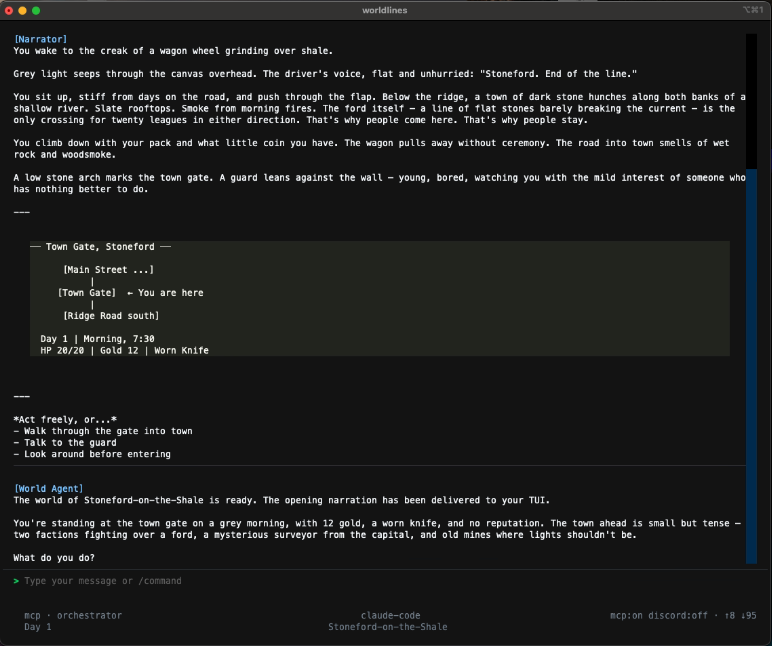

# Stoneford — WorldLines Starter World


> A grey-fog northern river port for the [WorldLines](https://worldlines.gg) engine. Classic-fantasy TRPG · d20 dice · 10-agent orchestrator.

**Language:** [English](./README.md) · [简体中文](./README.zh.md) · [日本語](./README.ja.md) · [한국어](./README.ko.md)

<p align="center">
  <a href="https://youtu.be/QARKAA8bXDk">
    
  </a>
</p>
<p align="center"><em>▶ Watch the trailer on YouTube</em></p>

<table align="center">
  <tr>
    <td width="50%" align="center"></td>
    <td width="50%" align="center"></td>
  </tr>
  <tr>
    <td width="50%" align="center"></td>
    <td width="50%" align="center"></td>
  </tr>
</table>

> **Engine:** Stoneford runs on the [WorldLines](https://github.com/LudicDynamics/WorldLines) engine. For the engine itself, runtime, and full docs → [LudicDynamics/WorldLines](https://github.com/LudicDynamics/WorldLines).

> **Disclaimer:** Stoneford is an original scenario co-authored by **nikoloside**, **redoctober**, and Claude, blending Eastern worldbuilding with Western medieval magic. If anything in here resembles other work, please reach out to the original authors so we can revise and update it.

---

## Quickstart

Two ways to run Stoneford — pick whichever you already have.

### A. With WorldLines (standalone)

```bash
# 1. Install WorldLines (engine codename: neonrp)
curl -LsSf https://worldlines.gg/install.sh | sh    # macOS / Linux
# or on Windows PowerShell:
#   irm https://worldlines.gg/install.ps1 | iex

# 2. Scaffold stoneford into a fresh directory
mkdir my-stoneford && cd my-stoneford
neonrp game new --template stoneford

# 3. Launch the TUI and start playing
neonrp tui
```

At the prompt, type `look around` and press Enter. The orchestrator routes
your turn to the right domain agent; narration appears; a new event is
logged. That is your first agentic turn.

### B. With Claude Code (drop-in)

**Already have [Claude Code](https://claude.com/claude-code)?** This
template is designed to run inside it without any WorldLines install.

```bash
# Clone the starter (or copy this folder into any project)
git clone https://github.com/LudicDynamics/stoneford-worldlines.git
cd stoneford-worldlines

# Open in Claude Code
claude
```

Then type:

```
@orchestrator 开始游戏
```

(Or in English: `@orchestrator start the game`.) Claude Code reads
`.claude/agents/*.md` automatically — `orchestrator` routes the domain
agents, reads / writes files under `game/`, and drives the scene.

<p align="center">
  
</p>

---

## Agent architecture (4 layers · 10 agents)

```
Layer 1  @orchestrator       — main router; every player input arrives here first
Layer 2  @town-agent         — town interactions (NPCs, shops, guild, inn)
         @dungeon-agent      — dungeon exploration
         @combat-referee     — d20 combat adjudication
         @rules-referee      — dice + skill rulings (structured JSON; no prose)
         @world-builder      — world-map / lore updates
Layer 3  @npc-mind           — single-NPC private POV (one NPC at a time)
         @story-narrative    — drift fallback narration (outside authored zones)
Layer 4  @clock-keeper       — world clock + scheduled events (JSON only)
         @world-evolution    — long-term world drift (proposes changes only)
```

**Routing rule:** only `orchestrator` has triggers. Every other agent is
reachable **only** through `orchestrator` via the `task()` tool — that
keeps the scene coherent and the event log readable.

| Temperature | Agents                                    | Why               |
|-------------|-------------------------------------------|-------------------|
| High        | orchestrator · town-agent · dungeon-agent · npc-mind · story-narrative | Narrative voice   |
| Low (0.3)   | combat-referee · rules-referee · clock-keeper · world-evolution · world-builder | Deterministic output |

---

## World content

| Kind    | ID   | Name                   | Notes                                                       |
|---------|------|------------------------|-------------------------------------------------------------|
| Town    | T001 | 石津镇 Stoneford        | Start location. Guild / general store / inn / chapel / docks. |
| Town    | T004 | 翠穴镇 Jadehollow       | Mining town. Deepvein clan. Guild tower · herb shop · tavern. |
| Dungeon | D001 | 苔墓 Mossbarrow         | 4 rooms. Something whispers inside.                         |
| Rules   | —    | d20 + attribute mods + status effects                                                                     |

Player starts at Day 1, Autumn dusk, 16:30, North Gate of Stoneford.
Level 1 warrior, HP 24/24, MP 8/8, gear: longsword + leather.

---

## Directory layout

```
stoneford-worldlines/
├── CLAUDE.md                 # Claude Code entrypoint (@orchestrator instructions)
├── README.md                 # This file
├── runtime_contract.json     # Engine runtime declarations
├── agents/                   # 10 WorldLines agents
│   ├── orchestrator/         # Layer 1 — main router
│   ├── town-agent/           # Layer 2 — domain agents
│   ├── dungeon-agent/
│   ├── combat-referee/
│   ├── rules-referee/
│   ├── world-builder/
│   ├── npc-mind/             # Layer 3 — perspective agents
│   ├── story-narrative/
│   ├── clock-keeper/         # Layer 4 — world-time agents
│   └── world-evolution/
└── game/
    ├── meta/                 # run_state, game-start, schedule, flags
    ├── player/               # profile, stats, inventory, wallet, journal
    ├── towns/                # T001 Stoneford, T004 Jadehollow
    ├── dungeons/D001/        # Mossbarrow
    ├── lore/                 # story, notes, rumors
    ├── rules/                # d20 combat rules
    └── world/                # world_map.json
```

**Key files:**

| File                              | Purpose                                          |
|-----------------------------------|--------------------------------------------------|
| `game/meta/run_state.json`        | World state (location, time, last action)        |
| `game/meta/game-start.json`       | Day-1 opening scene played on first turn         |
| `game/player/stats.json`          | HP / MP / attributes / modifiers                 |
| `agents/orchestrator/system.md`   | Top-level router prompt                          |

---

## Dice system

All uncertain actions resolve as `d20 + attribute mod + situation mod ≥ DC`.

| Check       | Attribute | Typical DC |
|-------------|-----------|------------|
| Persuasion  | CHA       | 12–20      |
| Stealth     | DEX       | 14–18      |
| Athletics   | STR       | 12–18      |
| Perception  | DEX       | 12–18      |
| Herbalism   | INT       | 12–16      |
| Lockpick    | DEX       | 15–20      |

Natural 20 = great success. Natural 1 = great failure.

---

## House rules

- All uncertain actions are d20-resolved. No invisible walls.
- HP 0 = death. No automatic revive.
- NPC affection is permanent. Cross someone and they remember.
- Every quest has a faction motive. No "purely good deeds."
- Player freedom first — the first option is always "act freely." Suggestions are reference only.

---

## Extending Stoneford

1. **Add a town**: create `game/towns/T00X/` with `town.json`, `npcs.json`, `quests.json`, `facilities/*.json`.
2. **Add a dungeon**: create `game/dungeons/D00X/` with `dungeon.json`, `layout.json`, `rooms/*.json`.
3. **Add NPCs**: append to `npcs.json`. `orchestrator` will reason about them on the next turn.
4. **Add monsters**: extend encounter tables or add a `species.md` in `game/world/`.
5. **Add relics**: create `game/world/relics.md` (tiered A → F — see the expansion pack for a filled example).

---

## Expanded world pack — `stoneford-worldlines-full.zip`

This folder is the **starter** Stoneford — 2 towns, 1 dungeon, a handful
of quests. Same 10-agent harness; just enough to learn it.

The bundled `stoneford-worldlines-full.zip` is a **content expansion**
of the same Stoneford: same engine, same agents, *much more world*.
Unzip it when you want the campaign-scale setting that powers the
Cold Release trailer:

```bash
unzip stoneford-worldlines-full.zip
cd stoneford-worldlines-full
neonrp tui        # or: claude
```

**What the expansion adds on top of the starter:**

| Content     | Starter (this folder)        | Full (`.zip`)                                                                  |
|-------------|------------------------------|--------------------------------------------------------------------------------|
| Agents      | 10-agent 4-layer             | Same 10-agent layout (one richer `npc-mind` prompt)                            |
| Towns       | 2 (T001 Stoneford, T004 Jadehollow) | **5** — adds T002 Windrest Keep, T003 Wolfsjaw Pass, T005 Mistmere      |
| Dungeons    | 1 (Mossbarrow, 4 rooms)      | 1 flagship (Mossbarrow) + `dungeons-design/` seed stubs                        |
| Quests      | Starter set across 2 towns   | **28 named quests + 1 boss** (*The Drowned Thing*)                             |
| Story       | Opening scene                | **3 intertwined backlines** — political conspiracies spanning all 5 towns      |
| Factions    | —                            | **5 factions** — Crown's Hand / The Faith / Free North / The Union / The Fog   |
| Houses      | —                            | 3 Houses of Stoneford (Blackwater / Ashford / Deepvein)                        |
| Lore        | story / notes / rumors       | +`foundation/` mythology, +`beyond-the-world.md`                               |
| World       | `world_map.json`             | +`cultures/`, +`species.md`, +`relics.md`, +`items.md`                          |
| Tone        | Classic-fantasy TRPG         | Low-fantasy political intrigue × grim monster-hunter × eastern metaphysics     |

The agent layout is the same — this is just more Stoneford.

---

## License

AGPL-3.0-only. See [LICENSE](./LICENSE).

Copyright © 2026 Ludic Dynamics.

Drifted from the earlier `llm-rpg-starter` project. Narrative design by
**nikoloside** and **redoctober**. d20 rules follow open SRD conventions.

## Links

- **Template repo**: [LudicDynamics/stoneford-worldlines](https://github.com/LudicDynamics/stoneford-worldlines)
- **Engine**: [worldlines.gg](https://worldlines.gg) · [docs](https://docs.worldlines.gg) · [GitHub](https://github.com/LudicDynamics/WorldLines)
- **Discord**: [discord.gg/HJYWbdqWrE](https://discord.gg/HJYWbdqWrE)
- **Policies**: [SECURITY.md](./SECURITY.md) · [CODE_OF_CONDUCT.md](./CODE_OF_CONDUCT.md)
- **Full Stoneford**: `stoneford-worldlines-full.zip` — content expansion: +3 towns, 28 quests, 3 political backlines (see section above)
